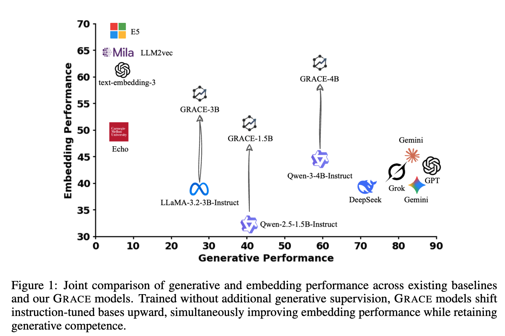
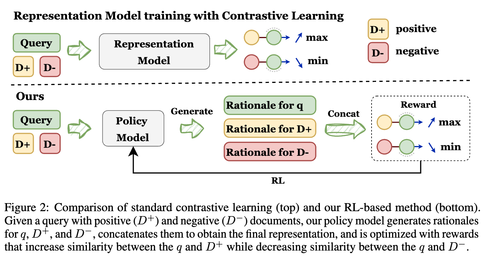
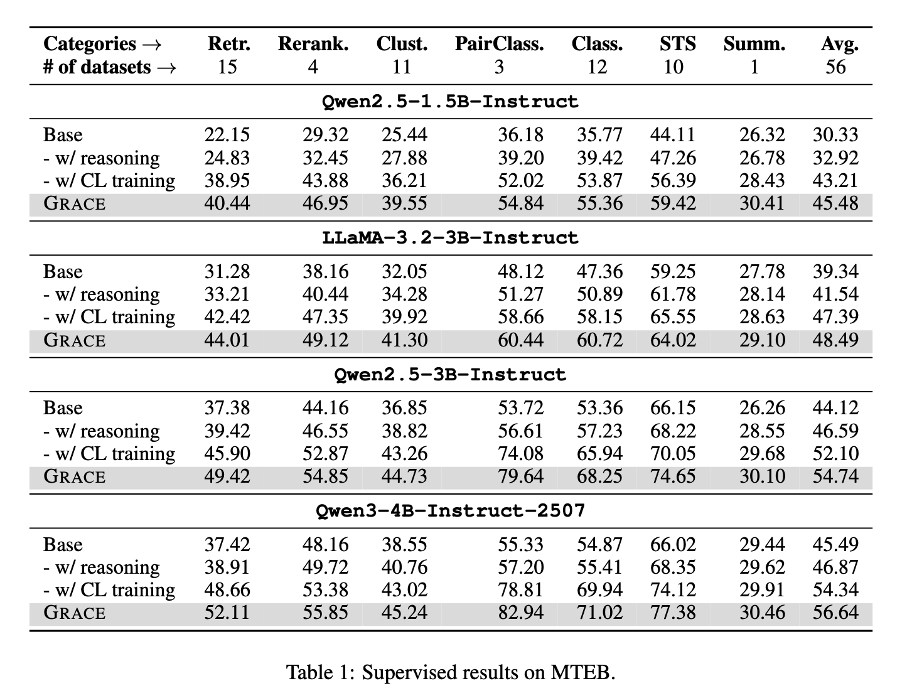
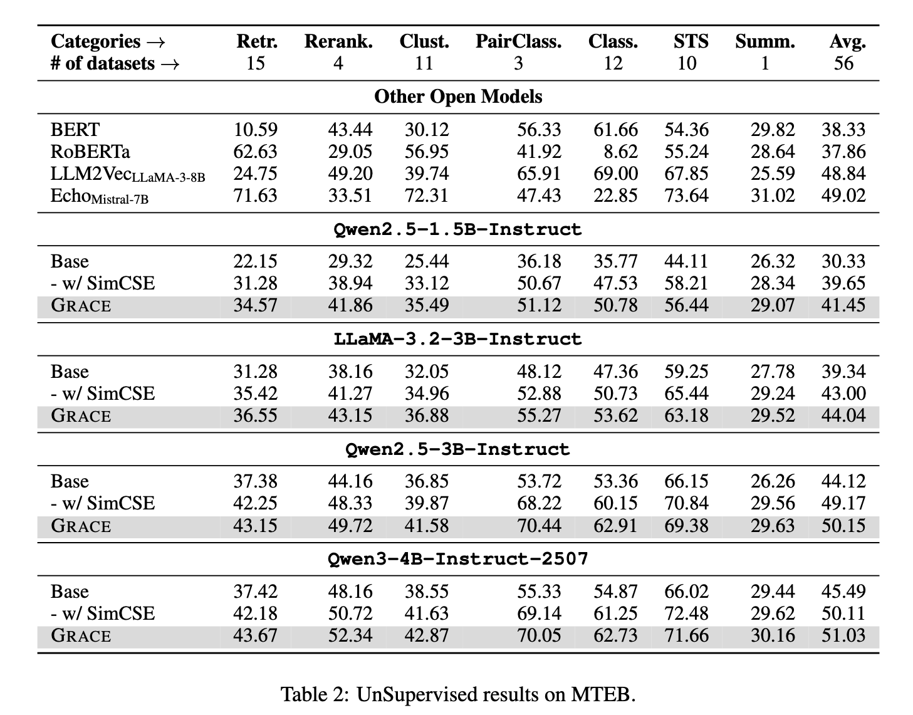
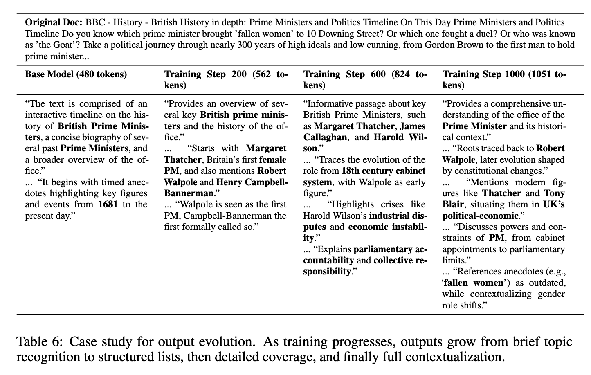

# GRACE: Generative Representation Learning via Contrastive Policy Optimization

<div style='display:flex; gap: 0.25rem; flex-wrap: wrap; align-items: center;'>
  <a href='LICENSE'>
    
  </a>
  <!-- <a href='https://arxiv.org/abs/2505.07233'>
    
  </a> -->
</div>

**Our method can improve the embedding performance while retaining the generative performance.**  

<div style="text-align: center;">
  <a href="">
    
  </a>
</div>


## 🔥 Update
* [2025-10-02]: 🚀 We release the code for training and evaluation.

## Table of Contents

- [GRACE Overview](#grace-overview)
- [Project Visualizations](#project-visualizations)
- [📌 Data Processing Pipeline](#-data-processing-pipeline)
- [🎯 Reinforcement Learning for Supervised Training](#-reinforcement-learning-for-supervised-training)
- [🤖 Reinforcement Learning for Unsupervised Training](#-reinforcement-learning-for-unsupervised-training)
- [🔍 Inference and Evaluation](#-inference-and-evaluation)
- [📄 Licensing and Claims](#-licensing-and-claims)

---

## GRACE Overview

We present GRACE (Generative Representation Learning via Contrastive
Policy Optimization), a framework that turns LLMs into interpretable representation learners using policy-gradient optimization. The model first produces explicit rationales $r$ that analyzes and reasons about the input. From $r$ we derive the final embedding $h$ via mean pooling over hidden states. We recast contrastive learning signals as rewards that increase query–positive similarity and decrease query–negative similarity. Optimizing this reward with standard policy-gradient methods teaches the model to generate faithful rationales while simultaneously learning effective text representations.

### Contributions:

(1) We present the first empirical evidence that rewards derived from contrastive learning can be leveraged to train policy models, resulting in improved representational capabilities.

(2) We propose a novel methodology that enables the transformation of existing LLMs into powerful representation models while preserving their general-purpose capabilities without performance degradation.

(3) This work represents a substantial advancement in text representation interpretability, as the model’s reasoning can be directly inspected through its textual outputs.

(4) Our method yields a significant performance gain of avg 11.5 % over baseline models when evaluated on the MTEB benchmark.

---

## 💡 Preliminaries
You should install the environment by `pip install -r requirements.txt`.

Moreover, we developed our algorithm and pipeline based on [verl](https://github.com/volcengine/verl), version 0.4.0dev, so after installing dependencies please run `pip install -e .` at the project root.

## ⚡ Quickstart

1) Install dependencies and editable package:

```bash
pip install -r requirements.txt
pip install -e .
```

2) Prepare data (both supervised and unsupervised are supported). The following script wraps the steps in this README:

```bash
bash process_data.sh
```

3) Train (edit `data.train_files`, `data.val_files`, and `+data.train_mode` in `train.sh` if needed):

```bash
bash train.sh
```

4) Evaluate on MTEB with vLLM (ensure merged checkpoints are pointed by `MODEL_PATH` in `eval.sh`):

```bash
bash eval.sh
```

## 📁 Project Structure (brief)

```
GRACE/
  assets/                 # Figures used in README
  scripts/                # Utilities such as model merging
  verl/                   # Training framework (0.4.0dev-based)
  process_data.py         # Convert raw data to parquet for training
  offline_filter_data.py  # Pre-filter overlong samples
  eval_mteb.py            # vLLM-based MTEB evaluation entry
  train.sh                # Supervised training example (GRPO)
  eval.sh                 # Inference + evaluation example
  process_data.sh         # End-to-end data prep helper
  requirements.txt
  pyproject.toml          # Packaging for editable install
  README.md
```

## 📌 Data Processing Pipeline

You can find the data from following link:
Supervised data: [Data](https://drive.google.com/file/d/1YqgaJIzmBIH37XBxpRPCVzV_CLh6aOI4/view) from [Repetition Improves Language Model Embeddings](https://arxiv.org/abs/2402.15449)


Unsupervised data: [Wiki1m_for_simcse](https://huggingface.co/datasets/princeton-nlp/datasets-for-simcse/resolve/main/wiki1m_for_simcse.txt) from [SimCSE: Simple Contrastive Learning of Sentence Embeddings](https://arxiv.org/abs/2104.08821)


After downloading the data, you can directly run:

```bash
#!/bin/bash

set -e  # Exit on any error

echo "Processing supervised data..."

python process_data.py \
    --input_file echo_data_total.jsonl \
    --local_dir data/supervised \
    --mode supervised \
    --test_ratio 0.01

sleep 3

python offline_filter_data.py \
    --train_parquet data/supervised/train.parquet \
    --val_parquet   data/supervised/test.parquet \
    --out_dir       data/supervised_filtered_overlong/ \
    --tokenizer_path Qwen/Qwen2.5-1.5B-Instruct \
    --max_len 1024

# echo "Processing unsupervised data..."

python process_data.py \
    --input_file wiki1m_for_simcse.txt \
    --local_dir data/unsupervised \
    --mode unsupervised \
    --test_ratio 0.01

sleep 3

python offline_filter_data.py \
    --train_parquet data/unsupervised/train.parquet \
    --val_parquet   data/unsupervised/test.parquet \
    --out_dir       data/unsupervised_filtered_overlong/ \
    --tokenizer_path Qwen/Qwen2.5-1.5B-Instruct \
    --max_len 1024

```
which can be found at `process_data.sh`

This operation first processes the data into a format that verl can recognize. In addition, because the amount of data is large, we will process the overlong data in advance to prevent this step from taking too long during training.

---

## 🎯 Reinforcement Learning for Supervised Training
To train the model, you can directly using following command:

```bash
#!/bin/bash

mkdir -p logs

export HF_DATASETS_CACHE="huggingface_cache"
export HF_HOME="huggingface_cache"

export CUDA_VISIBLE_DEVICES=0,1,2,3
export VLLM_TORCH_COMPILE_LEVEL=0
export TORCH_COMPILE_DISABLE=1

python3 -m verl.trainer.main_ppo \
    algorithm.adv_estimator=grpo \
    algorithm.norm_adv_by_std_in_grpo=False \
    data.train_files=data/supervised_filtered_overlong/train.parquet \
    data.val_files=data/supervised_filtered_overlong/test.parquet \
    data.train_batch_size=64 \
    data.val_batch_size=16 \
    data.max_prompt_length=1024 \
    data.max_response_length=2048 \
    data.filter_overlong_prompts=False \
    data.truncation='right' \
    +data.train_mode=supervised \
    actor_rollout_ref.model.path=Qwen/Qwen2.5-1.5B-Instruct \
    actor_rollout_ref.actor.optim.lr=1e-6 \
    actor_rollout_ref.model.use_remove_padding=True \
    actor_rollout_ref.actor.use_kl_loss=True \
    actor_rollout_ref.actor.kl_loss_coef=0 \
    actor_rollout_ref.actor.kl_loss_type=low_var_kl \
    actor_rollout_ref.actor.entropy_coeff=0 \
    actor_rollout_ref.model.enable_gradient_checkpointing=True \
    actor_rollout_ref.actor.fsdp_config.param_offload=True \
    actor_rollout_ref.actor.fsdp_config.optimizer_offload=True \
    actor_rollout_ref.actor.fsdp_config.offload_policy=True \
    actor_rollout_ref.actor.use_dynamic_bsz=True \
    actor_rollout_ref.actor.ppo_mini_batch_size=16 \
    actor_rollout_ref.actor.ppo_max_token_len_per_gpu=16384 \
    actor_rollout_ref.rollout.tensor_model_parallel_size=2 \
    actor_rollout_ref.rollout.gpu_memory_utilization=0.5 \
    actor_rollout_ref.rollout.enable_chunked_prefill=False \
    actor_rollout_ref.rollout.enforce_eager=True \
    actor_rollout_ref.rollout.name=vllm \
    actor_rollout_ref.rollout.free_cache_engine=False \
    actor_rollout_ref.rollout.n=8 \
    actor_rollout_ref.rollout.log_prob_use_dynamic_bsz=True \
    actor_rollout_ref.ref.fsdp_config.param_offload=True \
    actor_rollout_ref.ref.log_prob_use_dynamic_bsz=True \
    algorithm.use_kl_in_reward=False \
    reward_model.enable=False \
    reward_model.reward_manager=hidden \
    trainer.critic_warmup=0 \
    +reward_model.reward_kwargs.temperature=0.1 \
    +reward_model.reward_kwargs.with_scale=True \
    +reward_model.reward_kwargs.clustering_weight=0.2 \
    +reward_model.reward_kwargs.cross_group_weight=0.2 \
    trainer.logger='["wandb"]' \
    trainer.project_name='GRACE' \
    trainer.experiment_name='test_exp' \
    trainer.n_gpus_per_node=4 \
    trainer.nnodes=1 \
    trainer.save_freq=50 \
    trainer.test_freq=-1 \
    trainer.val_before_train=False \
    trainer.total_epochs=2
```
which can be found at `train.sh`. You need to modify `data.train_files`, `data.val_files`, and `+data.train_mode` before training.

> 🛠️ We used **4× H100-80G GPUs** to train all models.

---

## 🎯 Reinforcement Learning for Unsupervised Training
To train the unsupervised model, you can directly using following command:

```bash
#!/bin/bash

mkdir -p logs

export HF_DATASETS_CACHE="huggingface_cache"
export HF_HOME="huggingface_cache"

export CUDA_VISIBLE_DEVICES=0,1,2,3
export VLLM_TORCH_COMPILE_LEVEL=0
export TORCH_COMPILE_DISABLE=1

python3 -m verl.trainer.main_ppo \
    algorithm.adv_estimator=grpo \
    algorithm.norm_adv_by_std_in_grpo=False \
    data.train_files=data/unsupervised_filtered_overlong/train.parquet \
    data.val_files=data/unsupervised_filtered_overlong/test.parquet \
    data.train_batch_size=64 \
    data.val_batch_size=16 \
    data.max_prompt_length=1024 \
    data.max_response_length=2048 \
    data.filter_overlong_prompts=False \
    data.truncation='right' \
    +data.train_mode=unsupervised \
    actor_rollout_ref.model.path=Qwen/Qwen2.5-1.5B-Instruct \
    actor_rollout_ref.actor.optim.lr=1e-6 \
    actor_rollout_ref.model.use_remove_padding=True \
    actor_rollout_ref.actor.use_kl_loss=True \
    actor_rollout_ref.actor.kl_loss_coef=0 \
    actor_rollout_ref.actor.kl_loss_type=low_var_kl \
    actor_rollout_ref.actor.entropy_coeff=0 \
    actor_rollout_ref.model.enable_gradient_checkpointing=True \
    actor_rollout_ref.actor.fsdp_config.param_offload=True \
    actor_rollout_ref.actor.fsdp_config.optimizer_offload=True \
    actor_rollout_ref.actor.fsdp_config.offload_policy=True \
    actor_rollout_ref.actor.use_dynamic_bsz=True \
    actor_rollout_ref.actor.ppo_mini_batch_size=16 \
    actor_rollout_ref.actor.ppo_max_token_len_per_gpu=16384 \
    actor_rollout_ref.rollout.tensor_model_parallel_size=2 \
    actor_rollout_ref.rollout.gpu_memory_utilization=0.5 \
    actor_rollout_ref.rollout.enable_chunked_prefill=False \
    actor_rollout_ref.rollout.enforce_eager=True \
    actor_rollout_ref.rollout.name=vllm \
    actor_rollout_ref.rollout.free_cache_engine=False \
    actor_rollout_ref.rollout.n=8 \
    actor_rollout_ref.rollout.log_prob_use_dynamic_bsz=True \
    actor_rollout_ref.ref.fsdp_config.param_offload=True \
    actor_rollout_ref.ref.log_prob_use_dynamic_bsz=True \
    algorithm.use_kl_in_reward=False \
    reward_model.enable=False \
    reward_model.reward_manager=hidden \
    trainer.critic_warmup=0 \
    +reward_model.reward_kwargs.temperature=0.1 \
    +reward_model.reward_kwargs.with_scale=True \
    +reward_model.reward_kwargs.clustering_weight=0.2 \
    +reward_model.reward_kwargs.cross_group_weight=0.2 \
    trainer.logger='["wandb"]' \
    trainer.project_name='GRACE' \
    trainer.experiment_name='test_exp' \
    trainer.n_gpus_per_node=4 \
    trainer.nnodes=1 \
    trainer.save_freq=50 \
    trainer.test_freq=-1 \
    trainer.val_before_train=False \
    trainer.total_epochs=2
```

Also remember to modify the `data.train_files`, `data.val_files`, `data.train_mode` before training.

---


## 🔍 Inference and Evaluation
We use **vLLM** for efficient inference, and use [MTEB benchmark](https://github.com/embeddings-benchmark/mteb) for evaluation.

```bash
#!/bin/bash

# Environment variables
export CUDA_VISIBLE_DEVICES=0,1,2,3
export VLLM_TORCH_COMPILE_LEVEL=0
export TORCH_COMPILE_DISABLE=1
export VLLM_USE_MODELSCOPE=false
export VLLM_WORKER_MULTIPROC_METHOD=spawn
export VLLM_ENGINE_ITERATION_TIMEOUT_S=1800
export TOKENIZERS_PARALLELISM=false

export INPUT_MAX_LENGTH=1024
export THINKING_MAX_LENGTH=2048
export POOLING_METHOD=mean
export VLLM_TENSOR_PARALLEL_SIZE=4
export VLLM_GPU_MEMORY_UTILIZATION=0.4

export HF_DATASETS_CACHE="huggingface_cache"
export HF_HOME="huggingface_cache"


export TRAIN_MODEL_NAME=checkpoints/
export TARGET_DIR=merge_models/

# Create target directory if it doesn't exist
mkdir -p "$TARGET_DIR"

echo "Starting model merge..."
# Merge model
python scripts/merge_model.py merge --backend fsdp \
    --hf_model_path Qwen/Qwen2.5-1.5B-Instruct \
    --local_dir "$TRAIN_MODEL_NAME" \
    --target_dir "$TARGET_DIR"

# echo "Model merge completed. Starting evaluation..."

# Task configuration by category
# Retrieval (15 tasks)
RETRIEVAL_TASKS="ArguAna CQADupstackRetrieval FiQA2018 NFCorpus SCIDOCS SciFact ClimateFEVER DBPedia NQ FEVER HotpotQA MSMARCO QuoraRetrieval TRECCOVID Touche2020"

# Reranking (4 tasks)
RERANKING_TASKS="AskUbuntuDupQuestions MindSmallReranking SciDocsRR StackOverflowDupQuestions"

# Clustering (11 tasks)
CLUSTERING_TASKS="ArxivClusteringP2P ArxivClusteringS2S BiorxivClusteringP2P BiorxivClusteringS2S MedrxivClusteringP2P MedrxivClusteringS2S RedditClustering RedditClusteringP2P StackExchangeClustering TwentyNewsgroupsClustering"

# Pair Classification (3 tasks)
PAIR_CLASSIFICATION_TASKS="SprintDuplicateQuestions TwitterSemEval2015 TwitterURLCorpus"

# Classification (12 tasks)
CLASSIFICATION_TASKS="AmazonCounterfactualClassification AmazonPolarityClassification AmazonReviewsClassification Banking77Classification EmotionClassification ImdbClassification ToxicConversationsClassification MTOPDomainClassification MassiveIntentClassification MassiveScenarioClassification MTOPIntentClassification TweetSentimentClassification"

# STS - Semantic Textual Similarity (10 tasks)
STS_TASKS="BIOSSES SICK-R STS12 STS13 STS14 STS15 STS16 STS17 STSBenchmark STS22"

# Summarization (1 task)
SUMMARIZATION_TASKS="SummEval"

# All tasks combined (excluding retrieval for now)
ALL_TASKS="$STS_TASKS $SUMMARIZATION_TASKS $RETRIEVAL_TASKS $RERANKING_TASKS $CLUSTERING_TASKS $PAIR_CLASSIFICATION_TASKS $CLASSIFICATION_TASKS"

# Subset tasks
SUBSET_TASKS="Banking77Classification EmotionClassification MedrxivClusteringS2S TwitterSemEval2015 AskUbuntuDupQuestions BIOSSES STS17 STSBenchmark SummEval"

# Choose which tasks to evaluate (modify this line as needed)
EVAL_TASKS=$ALL_TASKS # or $SUBSET_TASKS

# Model configuration
MODEL_NAME="GRACE-1.5B"
MODEL_PATH="$TARGET_DIR"


# Initialize timing log file
TIMING_LOG="timing_results_$(date +%Y%m%d_%H%M%S).txt"
echo "Task Timing Report - $(date)" > $TIMING_LOG
echo "=================================" >> $TIMING_LOG

# Overall start time
OVERALL_START=$(date +%s)

echo "Starting evaluation..."

python eval_mteb.py \
    --model_path "$MODEL_PATH" \
    --tasks $EVAL_TASKS \
    --output_dir results \
    --batch_size 16 \
    --input_max_length $INPUT_MAX_LENGTH \
    --thinking_max_length $THINKING_MAX_LENGTH \
    --vllm_tensor_parallel_size $VLLM_TENSOR_PARALLEL_SIZE \
    --vllm_gpu_memory_utilization $VLLM_GPU_MEMORY_UTILIZATION \
    --model_name "$MODEL_NAME" \
    --pooling_method $POOLING_METHOD

# Overall end time
OVERALL_END=$(date +%s)
OVERALL_DURATION=$((OVERALL_END - OVERALL_START))
OVERALL_MINUTES=$(echo "scale=2; $OVERALL_DURATION / 60" | bc)

echo "=================================" >> $TIMING_LOG
echo "Total evaluation time: $OVERALL_MINUTES minutes" >> $TIMING_LOG
echo "All tasks: $EVAL_TASKS" >> $TIMING_LOG
echo "=================================" >> $TIMING_LOG

# Print timing report
echo ""
echo "====== TIMING REPORT ======"
cat $TIMING_LOG
echo "==========================="

echo "Evaluation completed! All tasks processed with single model load."

```
which can be found at `eval.sh`. The direct inference code will be coming soon.

---


## Project Visualizations

Explore the key components and performance of GRACE through the following images:


- **Pipeline of GRACE:**  

<div style="text-align: center;">
  <a href="">
    
  </a>
</div>

- **Results for Supervised training:**  

<div style="text-align: center;">
  <a href="">
    
  </a>
</div>


- **Results for Unsupervised training:**  

<div style="text-align: center;">
  <a href="">
    
  </a>
</div>


- **Case Study:**  

<div style="text-align: center;">
  <a href="">
    
  </a>
</div>

<div style="text-align: center;">
  <a href="">
    
  </a>
</div>


---

## 🧰 Troubleshooting

- FlashAttention build errors: ensure CUDA/torch version compatibility and set `TORCH_CUDA_ARCH_LIST`; refer to `flash-attn` docs if compilation fails.
- vLLM OOM/timeout: lower `VLLM_GPU_MEMORY_UTILIZATION`, reduce `VLLM_TENSOR_PARALLEL_SIZE`, or shorten `THINKING_MAX_LENGTH`.
- PyArrow/Parquet issues: this repo expects `pyarrow>=19.0.0`. Reinstall with `pip install -U pyarrow` if parquet IO fails.
- MTEB version mismatch: we pin `mteb==1.38.33`. Align the version to reproduce scores.

## 📚 Citation

If you find GRACE useful in your research, please cite this repository. A formal paper/bib will be added upon publication.

## 🙏 Acknowledgements

This project builds upon excellent open-source efforts, including `vLLM` and `verl`.

---


## 📄 Licensing and Claims
This project is licensed under the Apache 2.0 protocol. The project assumes no legal responsibility for any output generated by the models and will not be held liable for any damages resulting from the use of the provided resources and outputs.
